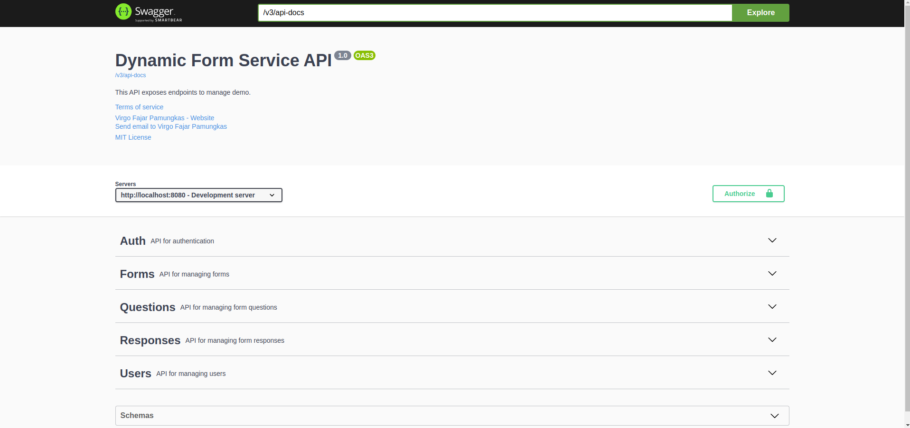

# Dynamic Form Project

Project ini adalah implementasi sederhana dari dynamic form seperti google form menggunakan Java 17 dan Maven. Proyek ini mencakup beberapa teknologi dan fitur seperti Spring IoC, Java Stream, Native SQL Query, dan PostgreSQL. Dokumentasi API dapat diakses melalui Swagger yang tersedia.

## Implementasi

- **Java 17**: Versi Java yang digunakan untuk proyek ini.
- **Maven**: Manajemen dependensi dan build.
- **Spring IoC**: Menggunakan Inversion of Control untuk pengelolaan bean dan dependensi.
- **Java Stream**: Penggunaan Java Stream API untuk memproses koleksi data.
- **JPA**: Menggunakan JPA untuk berinteraksi dengan database.
- **PostgreSQL**: Basis data relasional yang digunakan untuk menyimpan data aplikasi.
- **Swagger**: Dokumentasi API interaktif yang bisa diakses di `http://localhost:8080/swagger-ui/index.html`.

- 
## Prasyarat

Sebelum menjalankan proyek ini, pastikan Anda telah menginstal:

- DOCKER
- Java 17
- Maven
- PostgreSQL

## Instalasi dan Konfigurasi
1. **Clone repository:**
   ```bash
   git clone <repository-url>
   cd mini-ecommerce
    ```
2. **Masuk ke Direktori Project:**

properties
Copy code
```
cd dynamic-form
```

3. **Copy file ENV**

properties
Copy code
```
cp .env.example .env
```

4. **Jalankan Docker Composer**
    ```bash
   sudo docker compose up -d
    ```

## Struktur Proyek
```
src/main/java: Kode sumber utama aplikasi.
src/main/resources: Berkas konfigurasi dan resource lainnya, termasuk Postman Collection untuk testing.
pom.xml: Berkas konfigurasi Maven untuk mengelola dependensi dan build.
```

